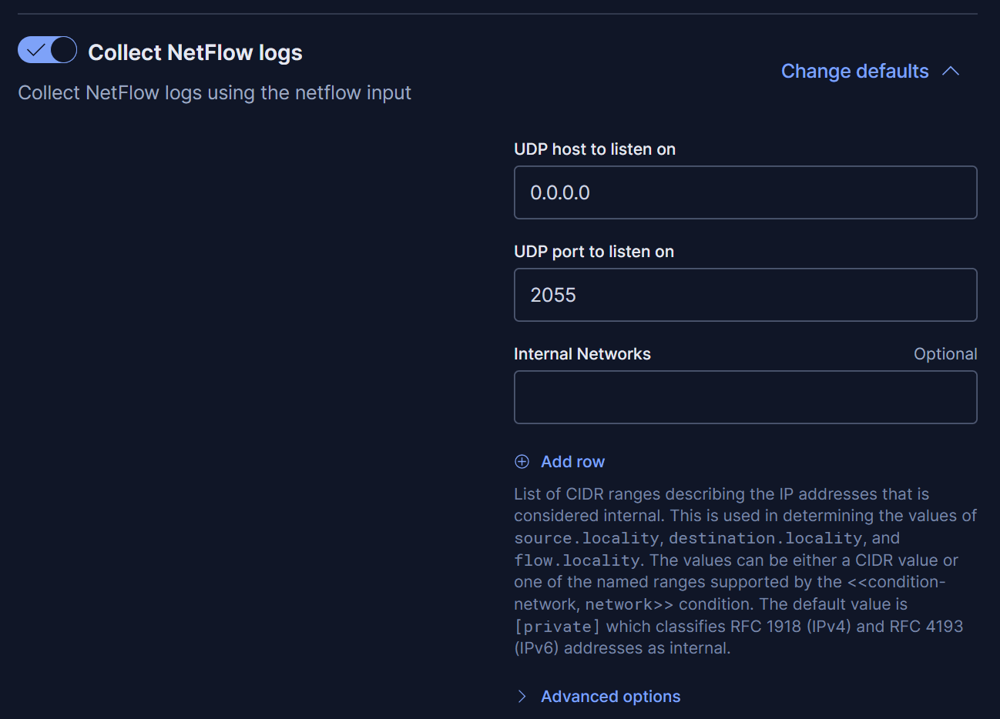
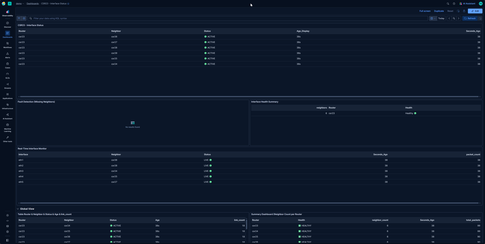
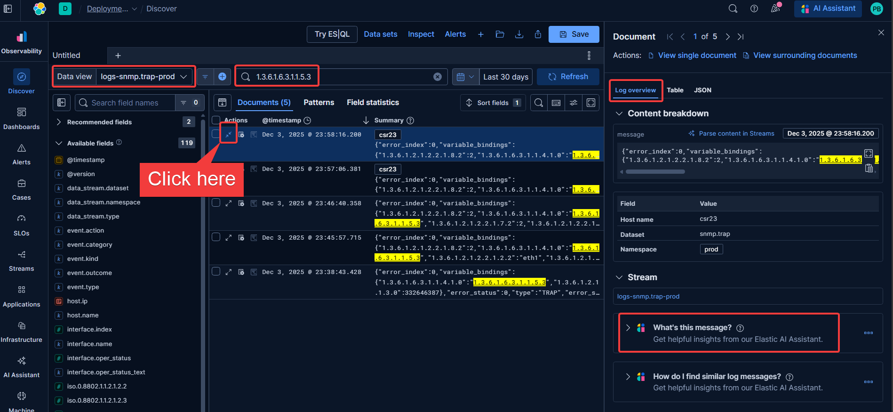
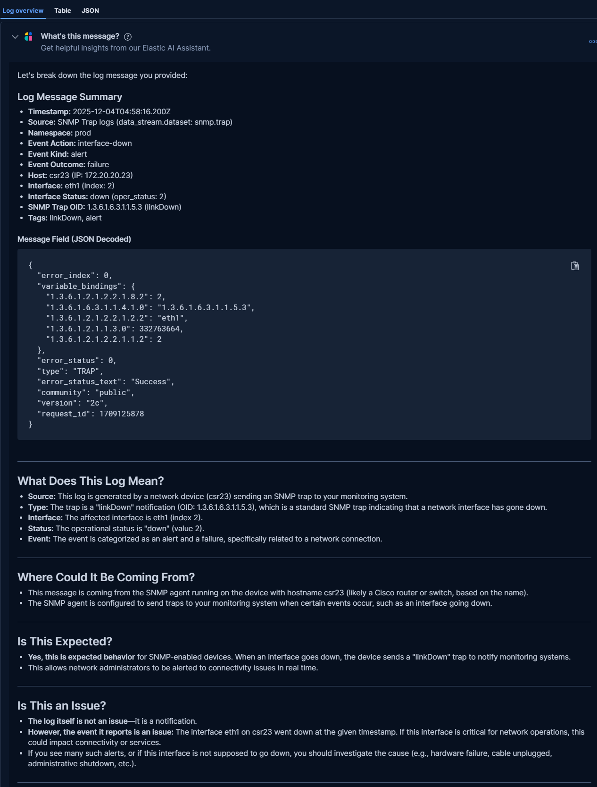
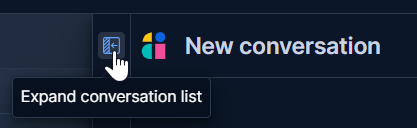
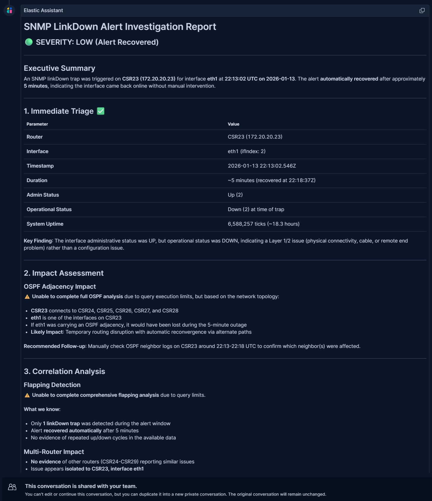

# Building a Unified Network Observability Lab with Elastic and Containerlab

## Introduction

This lab provides a self-contained, reproducible **Containerlab** simulation of an **OSPF Area 0** network core. It features a mesh of 7 **FRR routers** and two Ubuntu hosts to simulate end-user traffic.

The primary focus is on comprehensive network observability, integrating three distinct data pipelines into a managed **Elastic Cloud** stack:

*   **SNMP Polling (Metrics):** Collected via an **OTEL Collector**.
*   **NetFlow (Traffic Analysis):** Exported from all routers and collected by an **Elastic Agent**.
*   **SNMP Traps (Events/Logs):** Sent from `csr23` and processed by **Logstash**.

**Implemented Use Cases:**
*   Simulate SNMP Traps for CSR23 (eth1 down/up) and recover the trap in Elastic.
*   Simulate CSR23 down/up and visualize the status in the "CSR23 - Interface Status" dashboard.
*   Leverage AI to perform root cause analysis
*   Utilize two Linux hosts to simulate additional workloads.


## Quick Start

> **⚠️ IMPORTANT:** This lab is optimized for Elastic Serverless, Cloud Hosted, or linux VMs. On WSL2 Linux and macOS, specific prerequisites are required. Details are provided below.

**1. Infrastructure Requirements**
Suggested instance sizes for deployment:
*   **GCP:** e2-standard-2 (2 vCPU, 1 core, 8 GB memory, 20GB storage)
*   **AWS:** t3.large (2 vCPU, 8 GB memory, 20GB storage)
*   **Azure:** Standard_B2ms (2 vCPU, 8 GB memory, 20GB storage)
*   **Elasticsearch version:** 8.19 +,  9.x

**2. Setup**
*   Download the repository:
    *   [DeBaker1974/Containerlab-OSPF: Containerlab OSPF Simulation with OTEL, NetFlow, and SNMP](https://github.com/DeBaker1974/Containerlab-OSPF)
*   Obtain the following credentials:
    *   Elasticsearch Endpoint and API Key
    *   Fleet URL and Token (from a policy with NetFlow integration)


Here is the corrected and updated version:

**3. Prerequisites Installation**

First, navigate to the scripts directory and make the scripts executable:

```bash
cd ospf-otel-lab/scripts
chmod +x *
```

**Select your Operating System below:**

---

### 🐧 Option A: Linux VM (Ubuntu/Debian) — Recommended

Run the automated installer script. This will install Docker and Containerlab for you.

```bash
./install-lab-prereqs.sh
```

> **⚠️ Important:** You must **log out and log back in** (or run `newgrp docker`) after this step to apply Docker user permissions.

---

### 🪟 Option B: Windows (WSL2)

> **⚠️ Critical: Docker Desktop is NOT compatible with Containerlab on WSL2**
>
> Containerlab requires direct access to Linux network namespaces to create virtual network links between containers. Docker Desktop runs containers inside a hidden LinuxKit VM, which prevents Containerlab from accessing these namespaces. You **must** use native Docker Engine inside WSL2.

**If you have Docker Desktop installed:**

1. **Quit Docker Desktop** completely (right-click the system tray icon → Quit)
2. Disable WSL2 integration in Docker Desktop settings to prevent conflicts

**Install native Docker Engine in WSL2:**

```bash
# Install Docker Engine (not Docker Desktop)
curl -fsSL https://get.docker.com | sudo sh

# Add your user to the docker group
sudo usermod -aG docker $USER

# Start Docker service
sudo service docker start

# Apply group membership (or log out and back in)
newgrp docker

# Verify Docker is working
docker run --rm hello-world

# Verify it's native Docker (should show "Ubuntu", NOT "Docker Desktop")
docker info | grep "Operating System"
```

**Install Containerlab:**

```bash
sudo bash -c "$(curl -sL https://get.containerlab.dev)"
```

> **💡 Note:** You'll need to start Docker manually each time you open WSL2:
> ```bash
> sudo service docker start
> ```
> Or add it to your shell startup script (`~/.bashrc`).

---

### 🍎 Option C: macOS

> **⚠️ Important: macOS Limitation**
>
> Containerlab **does not support macOS natively**. It requires Linux kernel features (network namespaces, veth pairs) that do not exist on macOS. Docker Desktop alone is **NOT sufficient**.

**macOS users must run the lab inside a Linux environment using one of these methods:**

#### Method 1: Multipass (Recommended — Free & Easy)

[Multipass](https://multipass.run/) creates lightweight Ubuntu VMs on your Mac.

```bash
# Install Multipass
brew install multipass

# Create an Ubuntu VM with enough resources
multipass launch --name clab --cpus 4 --memory 8G --disk 50G

# Enter the VM
multipass shell clab

# Inside the VM: Clone the repo and install prerequisites
git clone https://github.com/YOUR_REPO/ospf-otel-lab.git
cd ospf-otel-lab/scripts
chmod +x *
./install-lab-prereqs.sh
```

> **⚠️ Important:** After running `install-lab-prereqs.sh`, you must **log out and log back in** (or run `newgrp docker`) to apply Docker user permissions.


#### Method 2: UTM or Parallels
Use [UTM](https://mac.getutm.app/) (free) or [Parallels](https://www.parallels.com/) (paid) to run an Ubuntu 22.04 VM, then follow the **Linux VM** instructions above.

#### Method 3: Cloud VM
Spin up an Ubuntu VM on AWS, GCP, Azure, or DigitalOcean and run the lab there.

---

**4. Configuration & Deployment**

Once the prerequisites are ready (and you are inside a Linux environment), run the configuration wizard followed by the main setup script:

```bash
./configure-elasticsearch-all-os.sh
./complete-setup-all-os.sh
```


----

## 1. High-Level Architecture

*   **Infrastructure:** Containerlab (Docker-based).
*   **Routing Protocol:** OSPF Area 0 (Single Area).
*   **Core Functions:** A mesh of 7 FRR routers simulating a Service Provider or Enterprise Core.
*   **Edge Functions:** Ubuntu hosts simulating end-user traffic (North/South).
*   **Observability Stack:** Elastic Stack (Cloud) receiving data via OTEL Collector, Logstash, and Elastic Agent.

## 2. Node Roles & Management IPs

All nodes reside on the clab management network: **172.20.20.0/24**.

| Node Name | Type | Mgmt IP | Role |
| :---: | :---: | :---: | :---: |
| **csr28** | FRR Router | .28 | **Top Hub / Core**. Gateway for Top Network. |
| **csr23** | FRR Router | .23 | **Core Router**. Metrics, **SNMP Trap Source**. |
| **csr24** | FRR Router | .24 | **Core Router**. Heavy mesh connectivity. |
| **csr25** | FRR Router | .25 | **Bottom Distribution**. Gateway for Bottom Network. |
| **csr26** | FRR Router | .26 | **Bottom Distribution**. Gateway for Bottom Network. |
| **csr27** | FRR Router | .27 | **Right Wing / Edge**. |
| **csr29** | FRR Router | .29 | **Left Wing / Edge**. |
| **linux-top** | Ubuntu Host | N/A | End User (Top). Data IP: 192.168.20.100. |
| **linux-bottom** | Ubuntu Host | N/A | End User (Bottom). Data IP: 192.168.10.20. |
| **elastic-agent** | Elastic Agent | .50 | **NetFlow Collector** (Port 2055). |
| **otel-col** | OTEL Contrib | Auto | **SNMP Poller**. Sends to Elastic Cloud. |
| **logstash** | Logstash | .31 | **SNMP Trap Receiver** (Port 1062). Sends to Elastic Cloud. |

## 3. Physical & Data Plane Topology

The network is structured as a vertical flow with a redundant core mesh.

### A. North (Top) Sector
*   **Components:** `linux-top` → `sw2` → `csr28`.
*   **Access Switch (sw2):**
    *   Connects `linux-top` (eth1).
    *   Connects `elastic-agent-sw2` (eth1).
    *   Uplink to `csr28` (eth3).
*   **Subnet:** 192.168.20.0/24 (Gateway: `csr28` IP .1).

### B. The Core Mesh (OSPF Area 0)
Routers connect via point-to-point **/31** links.

*   **CSR28 (Top Hub):** Down to `csr24`, `csr23`.
*   **CSR24 (Left Core):** Connects to `csr28` (Up), `csr23` (Cross), `csr29` (Left Edge), `csr26` (Down Left), `csr25` (Down Right).
*   **CSR23 (Right Core):** Connects to `csr28` (Up), `csr24` (Cross), `csr27` (Right Edge), `csr26` (Down Left), `csr25` (Down Right).
*   **CSR29 (Left Edge):** Connects to `csr24` & `csr26`.
*   **CSR27 (Right Edge):** Connects to `csr23` & `csr25`.

### C. South (Bottom) Sector
*   **Router Layer:** `csr25` and `csr26` act as redundant gateways.
*   **Access Switch (sw):**
    *   Uplink from `csr25` (eth5).
    *   Uplink from `csr26` (eth5).
    *   Connects `linux-bottom` (eth1).
*   **Subnet:** 192.168.10.0/24 (VRRP or ECMP style gateway on Routers .2 and .3).

## 4. Telemetry & Observability Architecture

Your setup uses three distinct pipelines flowing into **Elastic Cloud**.

### Pipeline 1: SNMP Polling (Metrics)
*   **Method:** Active Polling.
*   **Source:** `otel-collector` (Container).
*   **Targets:** All 7 Routers (172.20.20.23 - .29) on **UDP 161**.
*   **Data Types:**
    *   System Uptime, Memory.
    *   Interface Stats (see below).
    *   LLDP Neighbors.
    *   TCP/UDP/IP/ARP Stats.
*   **Destination:** Elastic Cloud (Indices: `metrics-snmp.*`).

| Metric | OID | Description | Type |
|--------|-----|-------------|------|
| `network.interface.in.bytes` | 1.3.6.1.2.1.31.1.1.1.6 | Bytes received (64-bit HC) | Counter |
| `network.interface.out.bytes` | 1.3.6.1.2.1.31.1.1.1.10 | Bytes transmitted (64-bit HC) | Counter |
| `network.interface.in.ucast.packets` | 1.3.6.1.2.1.2.2.1.11 | Unicast packets received | Counter |
| `network.interface.out.ucast.packets` | 1.3.6.1.2.1.2.2.1.17 | Unicast packets transmitted | Counter |
| `network.interface.in.errors` | 1.3.6.1.2.1.2.2.1.14 | Inbound errors | Counter |
| `network.interface.out.errors` | 1.3.6.1.2.1.2.2.1.20 | Outbound errors | Counter |
| `network.interface.in.discards` | 1.3.6.1.2.1.2.2.1.13 | Inbound discards | Counter |
| `network.interface.out.discards` | 1.3.6.1.2.1.2.2.1.19 | Outbound discards | Counter |
| `network.interface.admin.status` | 1.3.6.1.2.1.2.2.1.7 | Admin status (1=up, 2=down) | Gauge |
| `network.interface.status` | 1.3.6.1.2.1.2.2.1.8 | Oper status (1=up, 2=down) | Gauge |
| `network.interface.speed` | 1.3.6.1.2.1.31.1.1.1.15 | Interface speed (bps) | Gauge |

### Pipeline 2: NetFlow (Traffic Analysis)
*   **Method:** Push (Exporter).
*   **Source:** All Routers (via `softflowd` installed by `netflow-startup.sh`).
*   **Target:** `elastic-agent-sw2` (172.20.20.50) on **UDP 2055**.
*   **Data Types:** IP Flow data (5-tuple).
*   **Integration:** Fleet-managed Elastic Agent (Network Packet Capture integration).

### Pipeline 3: SNMP Traps (Events/Logs)
*   **Method:** Push (Trap/Notification).
*   **Source:** Explicitly configured on **csr23** only (per `snmpd.conf`).
*   **Configuration:** `trap2sink 172.20.20.31:1062`.
*   **Triggers:** Interface Up/Down events (monitored `eth1` through `eth5`).
*   **Target:** `logstash` (172.20.20.31) on **UDP 1062**.
*   **Processing:** Logstash
*   **Destination:** Elastic Cloud (Data Stream: `logs-snmp.trap-prod`).

## 5. Routing Logic (OSPF)

Derived from `frr.conf`:
*   **Router ID:** Loopback IP `10.255.0.X` (e.g., 10.255.0.23).
*   **Area:** All interfaces are in **Area 0**.
*   **Network Type:** `point-to-point` is explicitly configured on links to reduce OSPF overhead (no DR/BDR election).

## 6. Detailed Deployment Steps

### Step 1: Install Dependencies
Run the prerequisite script to install Docker CE and Containerlab.

```bash
cd ~/ospf-otel-lab
chmod +x scripts/install-lab-prereqs.sh
./scripts/install-lab-prereqs.sh
```

> **⚠️ IMPORTANT:** You must **Log Out** and **Log Back In** after this step for Docker group permissions to take effect.

### Step 2: Configure Elastic Cloud Connection
Set up your connection to the Elastic Stack. This script validates your credentials and auto-configures the specific versions for the lab.

1.  Obtain your **Elasticsearch Endpoint** (HTTPS URL).
2.  Create a **Base64 Encoded API Key** in Kibana (Stack Management → Security → API Keys).
3.  Create a Fleet policy enabling **Netflow Capture**.
4.  Create policy and add the integration: https://www.elastic.co/docs/reference/fleet/agent-policy#create-a-policy
      Set:
       - UDP host to listen on : 0.0.0.0
       - UDP port to listen on : 2055

See the configuration for the policy:



5.  Obtain the Fleet URL and the policy token: 
- Get a fleet token: https://www.elastic.co/docs/reference/fleet/fleet-enrollment-tokens     

Run the configuration wizard to configure the environment variables:

```bash
chmod +x scripts/configure-elasticsearch.sh
./scripts/configure-elasticsearch.sh
```

**What this does:**
*   Tests connectivity to Elastic Cloud.
*   Detects if you are using Serverless or Traditional Elastic.
*   Generates a local `.env` file used by the deployment script.
*   Hardcodes specific configuration files with your credentials.

### Step 3: Deploy the Network
Run the master deployment script. This is a "Zero-Touch" deployment that builds the entire topology and configures telemetry.

```bash
chmod +x scripts/complete-setup.sh
./scripts/complete-setup.sh
```

**This process takes approximately 12-15 minutes.**
*   **Cleanup:** Removes old containers and network bridges.
*   **Deploy:** Launches 14 containers defined in `ospf-network.clab.yml`.
*   **Bootstrap:** Installs `snmpd`, `lldpd`, and `softflowd` inside the FRR routers.
*   **Configure:** Enables SNMP AgentX for LLDP integration.
*   **Converge:** Waits for OSPF adjacencies to form.
*   **Verify:** Checks data flow for SNMP, LLDP, and Traps.

## 7. Verification & Access

### Lab Status Summary
At the end of the deployment, the script provides a health summary:
*   **SNMP:** Should show 7/7 routers responding.
*   **LLDP:** Should show neighbor relationships detected via SNMP.
*   **Elasticsearch:** Should verify data ingestion counts (Metrics & Logs).

### Accessing Devices
*   **Routers (VTysh):**
    ```bash
    docker exec -it clab-ospf-network-csr28 vtysh
    ```
*   **Linux Clients:**
    ```bash
    docker exec -it clab-ospf-network-linux-top bash
    ```
*   **Logstash Logs:**
    ```bash
    docker logs -f clab-ospf-network-logstash
    ```

## 8. Telemetry Data Flow Summary

| Data Type | Source | Transport | Collector | Destination |
| :---- | :---: | :---: | :---: | :---: |
| **Metrics** | FRR Routers | UDP 161 (SNMP) | OTEL Collector | `metrics-snmp.*` |
| **Traps** | CSR23 | UDP 1062 (SNMP Trap) | Logstash | `logs-snmp.trap-*` |
| **NetFlow** | All Routers | UDP 2055 (NetFlow v5) | Elastic Agent | `logs-network_traffic.*` |
| **Topology** | FRR Routers | AgentX (LLDP) | OTEL Collector | `lldp-topology` |

## 9. Transform: net-lldp-edges

To create the `net-lldp-edges` Index Mapping and Transform. This is required to summarize metrics to be used in our Status Dashboard
*   Ensure the setup is complete before executing this transform.
*   Ensure LLDP data is flowing.
*   Ensure the `lldp-topology` index exists.

**Create mapping:**

```json
PUT net-lldp-edges
{
  "mappings": {
    "properties": {
      "src_router": { "type": "keyword" },
      "dst_router": { "type": "keyword" },
      "last_seen": { "type": "date" },
      "first_seen": { "type": "date" },
      "observation_count": { "type": "long" },
      "neighbor_count": { "type": "long" }
    }
  }
}
```

**Create the transform:**

```json
PUT _transform/lldp-topology-to-edges
{
  "source": {
    "index": ["metrics-snmp.lldp-prod"],
    "query": {
      "bool": {
        "must": [
          { "exists": { "field": "network.lldp.rem.sysname" } }
        ],
        "must_not": [
          { "term": { "network.lldp.rem.sysname": "" } }
        ]
      }
    }
  },
  "dest": { "index": "net-lldp-edges" },
  "frequency": "1m",
  "sync": {
    "time": { "field": "@timestamp", "delay": "60s" }
  },
  "pivot": {
    "group_by": {
      "src_router": { "terms": { "field": "host.name" } },
      "dst_router": { "terms": { "field": "network.lldp.rem.sysname" } }
    },
    "aggregations": {
      "last_seen": { "max": { "field": "@timestamp" } },
      "first_seen": { "min": { "field": "@timestamp" } },
      "observation_count": { "value_count": { "field": "@timestamp" } },
      "neighbor_count": { "max": { "field": "network.lldp.neighbors" } }
    }
  },
  "description": "LLDP network topology - router-to-router connections (simplified)",
  "settings": { "max_page_search_size": 500 }
}
```
**Start the transform:**

```json
POST _transform/lldp-topology-to-edges/_start
```
## 10. Import the CSR23 Interface Status Dashboard

Import the pre-built dashboard to visualize interface health and neighbor relationships in real-time.

### Import via Kibana UI

1. In Kibana, navigate to: **Stack Management → Saved Objects**
2. Click the **Import** button (top right corner)
3. Click **Select a file to import**
4. Browse to your local repository and select: ~/ospf-otel-lab/configs/kibana/dashboards/csr23-interface-status.ndjson
5. Click **Import**

### Post-Import Steps

After importing, access your dashboard:

1. Navigate to **Analytics → Dashboards** (or click **Dashboards** in the left sidebar)
2. Search for: `CSR23`
3. Click on **"CSR23 - Interface Status"** to open

> **⚠️ Note:** This dashboard requires the `net-lldp-edges` transform from Step 10 to be running and populated with data. Allow 2-3 minutes after starting the transform for data to appear.

### Dashboard Overview

The **CSR23 - Interface Status** dashboard provides real-time visibility into router health and OSPF neighbor relationships.



### Dashboard Panels

| Panel | Description |
|-------|-------------|
| **CSR23 - Interface Status** | Top-level view showing all neighbors with status indicators (🟢 ACTIVE), age display, and last-seen timestamps |
| **Fault Detection (Missing Neighbors)** | Displays alerts when expected LLDP neighbors are missing — empty when healthy |
| **Interface Health Summary** | Aggregated view showing neighbor count per router and overall health status (🟢 Healthy) |
| **Real-Time Interface Monitor** | Per-interface breakdown (eth1-eth5) with neighbor names, live status, and packet counts |
| **Global View - Router & Neighbor Table** | Detailed table with router-to-neighbor mappings, status, age, and link counts |
| **Summary Dashboard (Neighbor Count per Router)** | Per-router summary showing health, neighbor count, last-seen time, and total packets |

### Key Indicators

- **🟢 ACTIVE / LIVE** — Interface is operational and LLDP neighbor is detected
- **🟢 Healthy** — Router has expected neighbor count and all interfaces responding
- **Seconds_Ago** — Time since last SNMP poll (should be ~30-40s when healthy)
- **packet_count** — Running count of SNMP observations for this interface

### Verifying Dashboard Data

After import, verify the dashboard is populated:

1. All 5 interfaces on CSR23 should show **LIVE** status
2. Neighbors should display: `csr24`, `csr25`, `csr26`, `csr27`, `csr28`
3. **Fault Detection** panel should show "No results found" (healthy state)
4. **Seconds_Ago** values should be < 60 seconds
**5. Finalize**
*   Import the Kibana dashboard: "CSR23 - Interface Status".

## 11. Create Alert in Kibana

1.  Navigate to: **Stack management > Rules > Create rules**
2.  Search: **Elasticsearch query**
3.  Select: **ES|QL**

**Query:**
```esql
FROM logs-snmp.trap-prod
| WHERE message LIKE "*1.3.6.1.6.3.1.1.5.3*"
```

4.  Select a time field: `@timestamp`
5.  Add action: **Observability AI Assistant**
6.  **Message Template:**

```markdown
An SNMP linkDown trap alert has been triggered.

## Alert Query
FROM logs-snmp.trap-prod
| WHERE event.action == "interface-down"
| KEEP @timestamp, host.name, host.ip, event.action, message

## Investigation Tasks

### 1. Immediate Triage
- Which router reported the link down? (host.name)
- Which interface went down? (extract from message or varbinds)
- When did this occur? (@timestamp)

### 2. Impact Assessment
- Is this interface part of an OSPF adjacency?
- Query metrics-* for OSPF neighbor state on this router
- Check if any OSPF neighbors were lost after this timestamp

### 3. Correlation
- Are there other linkDown traps from the same router in the last 30 minutes?
- Are other routers (csr23-csr29) also reporting link issues?
- Is this a flapping interface? (check for linkUp followed by linkDown)

### 4. Network Context
Topology: 7 FRR routers in OSPF mesh
- CSR23 (172.20.20.23) - trap source, connects to CSR24, CSR25, CSR26, CSR27, CSR28
- CSR24-CSR29 are peer routers

### 5. Recommended Actions
Based on findings, suggest:
- If single interface down: Check physical connectivity, cable, port
- If multiple interfaces: Check router health, power, upstream switch
- If OSPF impacted: Verify traffic is rerouting via alternate paths

Provide a summary with severity assessment (Critical/High/Medium/Low).
```

7.  Optional: Add **Elastic-Cloud-SMTP** to receive an email.
8.  **Rule name** :  Network Interface Down
9.  **Tags** : Network
10.  **Save** your rule.

**Use the DEV Tools to create your rule:**

```json
POST kbn:/api/alerting/rule
{
  "tags": [],
  "params": {
    "searchType": "esqlQuery",
    "timeWindowSize": 5,
    "timeWindowUnit": "m",
    "threshold": [
      0
    ],
    "thresholdComparator": ">",
    "size": 10,
    "esqlQuery": {
      "esql": "FROM logs-snmp.trap-prod\r\n| WHERE message LIKE \"*1.3.6.1.6.3.1.1.5.3*\""
    },
    "aggType": "count",
    "groupBy": "all",
    "termSize": 5,
    "sourceFields": [],
    "timeField": "@timestamp"
  },
  "schedule": {
    "interval": "1m"
  },
  "consumer": "alerts",
  "name": "Network Interface Down",
  "rule_type_id": ".es-query",
  "actions": [
    {
      "group": "query matched",
      "id": "system-connector-.observability-ai-assistant",
      "params": {
        "prompts": [
          {
            "statuses": [
              "active",
              "recovered",
              "untracked"
            ],
            "message": "An SNMP linkDown trap alert has been triggered.\n\n## Alert Query\nFROM logs-snmp.trap-prod\n| WHERE event.action == \"interface-down\"\n| KEEP @timestamp, host.name, host.ip, event.action, message\n\n## Investigation Tasks\n\n### 1. Immediate Triage\n- Which router reported the link down? (host.name)\n- Which interface went down? (extract from message or varbinds)\n- When did this occur? (@timestamp)\n\n### 2. Impact Assessment\n- Is this interface part of an OSPF adjacency?\n- Query metrics-* for OSPF neighbor state on this router\n- Check if any OSPF neighbors were lost after this timestamp\n\n### 3. Correlation\n- Are there other linkDown traps from the same router in the last 30 minutes?\n- Are other routers (csr23-csr29) also reporting link issues?\n- Is this a flapping interface? (check for linkUp followed by linkDown)\n\n### 4. Network Context\nTopology: 7 FRR routers in OSPF mesh\n- CSR23 (172.20.20.23) - trap source, connects to CSR24, CSR25, CSR26, CSR27, CSR28\n- CSR24-CSR29 are peer routers\n\n### 5. Recommended Actions\nBased on findings, suggest:\n- If single interface down: Check physical connectivity, cable, port\n- If multiple interfaces: Check router health, power, upstream switch\n- If OSPF impacted: Verify traffic is rerouting via alternate paths\n\nProvide a summary with severity assessment (Critical/High/Medium/Low)."
          }
        ],
        "message": "An SNMP linkDown trap alert has been triggered.\n\n## Alert Query\nFROM logs-snmp.trap-prod\n| WHERE event.action == \"interface-down\"\n| KEEP @timestamp, host.name, host.ip, event.action, message\n\n## Investigation Tasks\n\n### 1. Immediate Triage\n- Which router reported the link down? (host.name)\n- Which interface went down? (extract from message or varbinds)\n- When did this occur? (@timestamp)\n\n### 2. Impact Assessment\n- Is this interface part of an OSPF adjacency?\n- Query metrics-* for OSPF neighbor state on this router\n- Check if any OSPF neighbors were lost after this timestamp\n\n### 3. Correlation\n- Are there other linkDown traps from the same router in the last 30 minutes?\n- Are other routers (csr23-csr29) also reporting link issues?\n- Is this a flapping interface? (check for linkUp followed by linkDown)\n\n### 4. Network Context\nTopology: 7 FRR routers in OSPF mesh\n- CSR23 (172.20.20.23) - trap source, connects to CSR24, CSR25, CSR26, CSR27, CSR28\n- CSR24-CSR29 are peer routers\n\n### 5. Recommended Actions\nBased on findings, suggest:\n- If single interface down: Check physical connectivity, cable, port\n- If multiple interfaces: Check router health, power, upstream switch\n- If OSPF impacted: Verify traffic is rerouting via alternate paths\n\nProvide a summary with severity assessment (Critical/High/Medium/Low).",
        "connector": "Anthropic-Claude-Sonnet-4-5"
      },
      "frequency": {
        "notify_when": "onActionGroupChange",
        "throttle": null,
        "summary": false
      }
    }
  ],
  "alert_delay": {
    "active": 1
  }
}
```
## 12. Trigger a Failure

Use the provided script to simulate network events and prove Elastic can handle real-world scenarios. Choose menu 40 to generate **Interface eth1 DOWN** on CSR23.

Navigate to `/scripts` and execute:
```bash
./connect.sh
```

**Simulation Menu Options:**
*   **Option 40: Interface eth1 DOWN 🔴**
    *   Administratively shuts down the interface on CSR23.
    *   Sends an SNMP linkDown trap (OID `1.3.6.1.6.3.1.1.5.3`).
    *   Triggers OSPF reconvergence.
    *   Tests the entire observability pipeline.
*   **Option 41: Interface eth1 UP 🟢**
    *   Restores the interface.
    *   Sends an SNMP linkUp trap (OID `1.3.6.1.6.3.1.1.5.4`).
    *   Validates recovery detection.
*   **Option 46: Flap Interface (Down → Wait → Up) ⚡**
    *   Simulates an unstable link.
    *   Generates rapid-fire traps.
    *   Tests alert deduplication logic.
*   **Option 47: Watch for Traps (Live) 📊**
    *   Tails Logstash logs in real-time.
    *   Shows immediate feedback as traps arrive.
    *   Validates end-to-end pipeline.
*   **Option 48: Show CSR23 Interface Status 📋**
    *   Displays current interface states.
    *   Maps interfaces to OSPF neighbors.
    *   Provides context for troubleshooting.
*   **Option 49: Verify Trap Configuration 🔧**
    *   Checks SNMP trap setup.
    *   Tests connectivity to Logstash.
    *   Sends a test trap to validate the pipeline.

## 13. Kibana - Discover

**Discover** is the primary tool for exploring your Elasticsearch data in Kibana. Search and filter documents, analyze field structures, visualize patterns, and save findings to reuse later or share with dashboards. Whether investigating issues, analyzing trends, or validating data quality, Discover offers a flexible interface for understanding your data.

In our lab, we will use Discover to examine the incoming traps and gain insights into their data.
1.  Make sure you create a Data View for the index: `logs-snmp.trap-prod`.
2.  In **Discover**, choose your data view (`logs-snmp.trap-prod`) and search for: `1.3.6.1.6.3.1.1.5.3`.
3.  Open the flyout for one event, go to **Log overview**, and ask the assistant: *"What’s this message?"*



**Expected results:**


## 14. AI Assistant

Head to the **AI Assistant** at the top right corner. In the flyout, select **Expand Conversation List** (top left corner).



When your alert triggered, the prompt automatically generated an initial investigation.

See it for yourself:



**Well done! You have completed the lab.**

## 15. **What’s next?**

In upcoming blogs, we will explore how to parse data using **Streams**, build workflows with **One Workflow**, and leverage the **Agent Builder** (next-generation AI Assistant) to investigate and correlate events. Look out for the next blog in early 2026.
