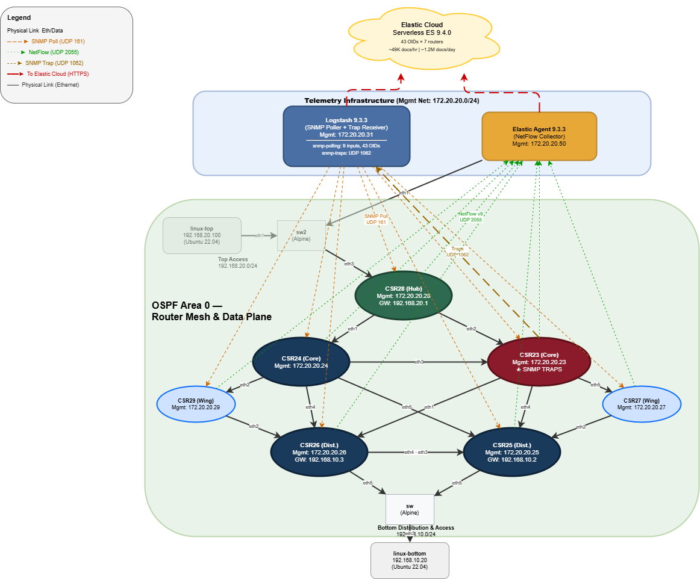
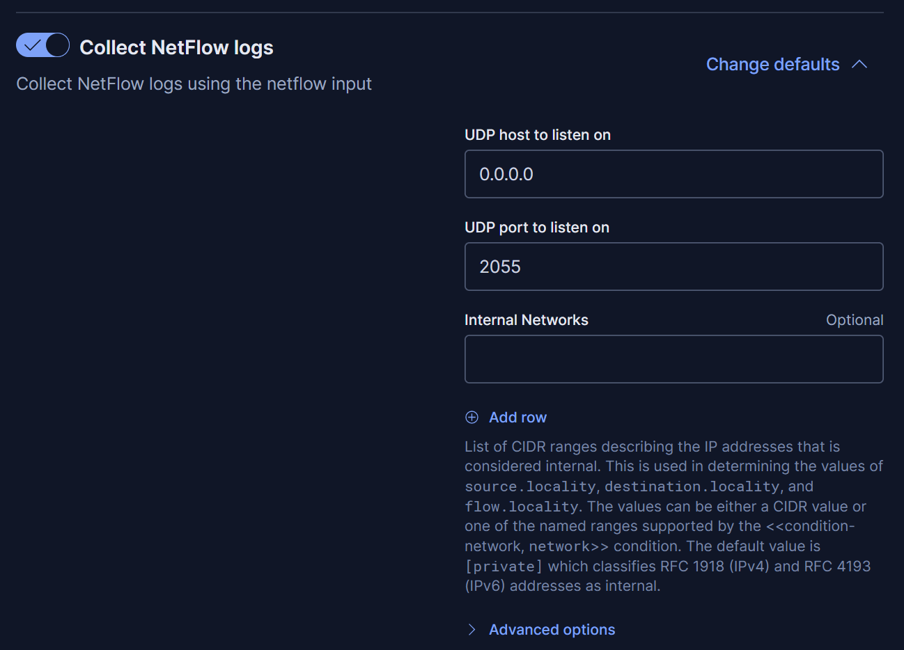
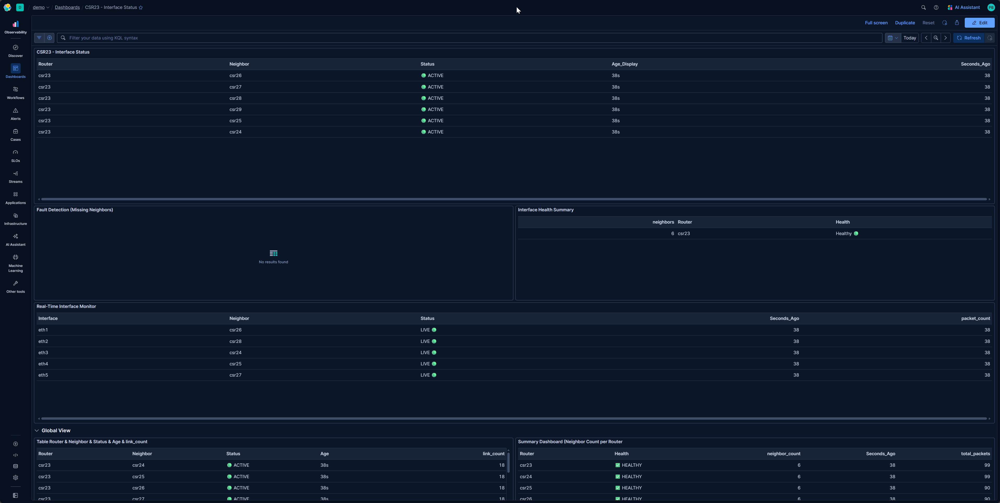
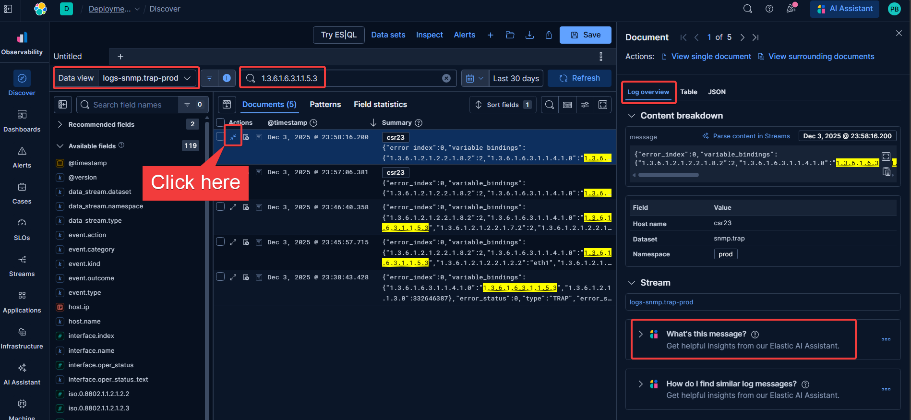
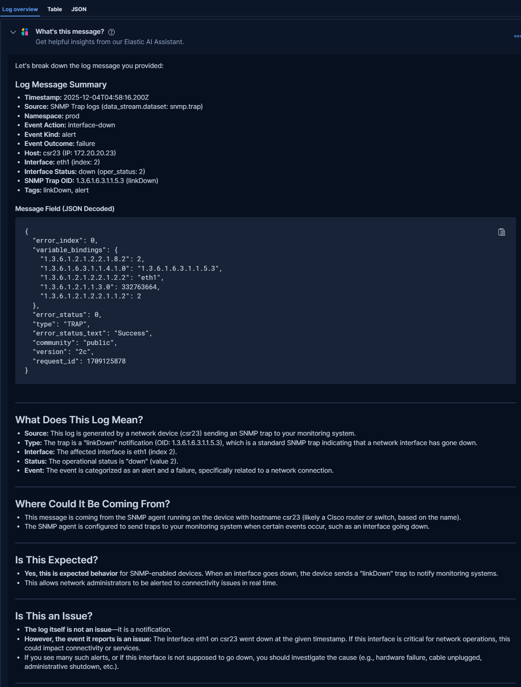
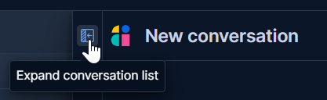
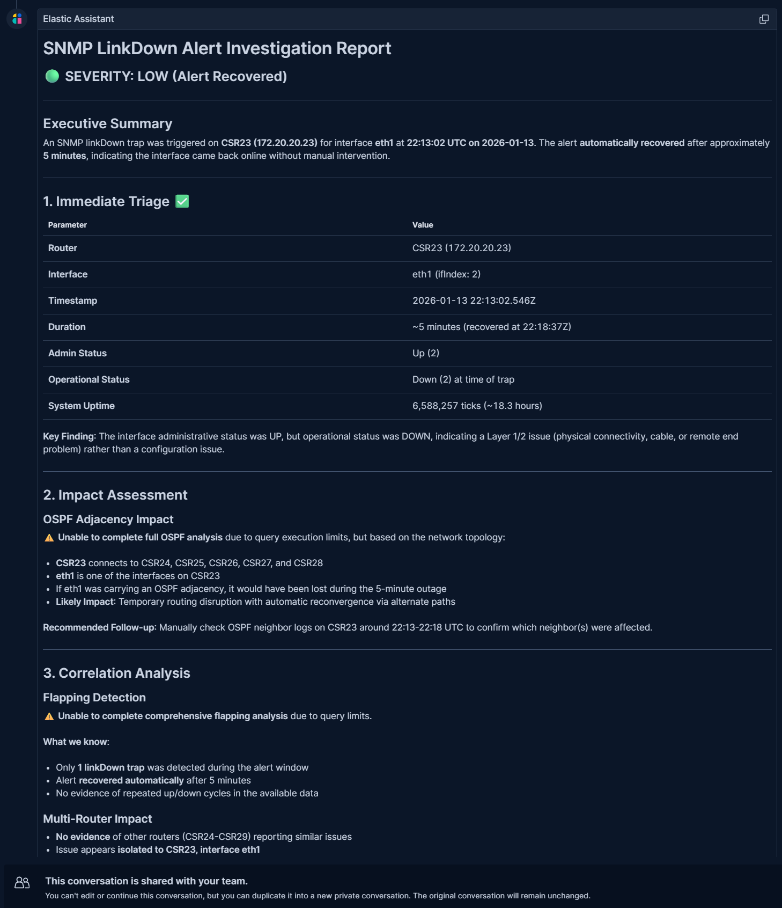

<h1 style="color: red;">UNDER CONSTRUCTION</h1>

# Corrected README.md

# Building a Unified Network Observability Lab with Elastic and Containerlab

## Introduction

This lab provides a self-contained, reproducible **Containerlab** simulation of an **OSPF Area 0** network core. It features a mesh of 7 **FRR routers** and two Ubuntu hosts to simulate end-user traffic.

The primary focus is on comprehensive network observability, integrating four distinct data pipelines into a managed **Elastic Cloud** stack:

*   **SNMP Polling (Metrics):** Collected via **Logstash** with the SNMP input plugin.
*   **OSPF Telemetry:** Collected via host-side `ospf-poller.sh` (vtysh JSON → Logstash HTTP).
*   **NetFlow (Traffic Analysis):** Exported from all routers and collected by an **Elastic Agent**.
*   **SNMP Traps (Events/Logs):** Sent from `csr23` and processed by **Logstash**.

**Implemented Use Cases:**
*   Simulate SNMP Traps for CSR23 (eth1 down/up) and recover the trap in Elastic.
*   Simulate CSR23 down/up and visualize the status in the "CSR23 - Interface Status" dashboard.
*   Detect NetFlow traffic bursts using ML anomaly detection.
*   Monitor router reachability via Synthetics (ICMP).
*   Leverage AI to perform root cause analysis.
*   Utilize two Linux hosts to simulate additional workloads.



---

## Quick Start

> <span style="color:red;">**⚠️ IMPORTANT:** At this time, this lab is optimized for Elastic Serverless</span>

**1. Infrastructure Requirements**
Suggested instance sizes for deployment:
*   **GCP:** e2-standard-2 (2 vCPU, 8 GB memory, 20GB storage)
*   **AWS:** t3.large (2 vCPU, 8 GB memory, 20GB storage)
*   **Azure:** Standard_B2ms (2 vCPU, 8 GB memory, 20GB storage)
*   **Elasticsearch version:** 8.19+, 9.x

**2. Setup**
*   Download the repository:
    *   [DeBaker1974/Containerlab-OSPF](https://github.com/DeBaker1974/Containerlab-OSPF)
*   Obtain the following credentials:
    *   Elasticsearch Endpoint and API Key
    *   Fleet URL and Token (from a policy with NetFlow integration)

---

## 3. Prerequisites Installation

First, navigate to the scripts directory and make the scripts executable:

```bash
cd ospf-otel-lab/scripts
chmod +x *
```

**Select your Operating System below:**

### 🐧 Option A: Linux VM (Ubuntu/Debian) — Recommended

```bash
./install-lab-prereqs.sh
```

> **⚠️ Important:** You must **log out and log back in** (or run `newgrp docker`) after this step to apply Docker user permissions.

### 🪟 Option B: Windows (WSL2)

> **⚠️ Critical: Docker Desktop is NOT compatible with Containerlab on WSL2**
>
> Containerlab requires direct access to Linux network namespaces. Docker Desktop runs containers inside a hidden LinuxKit VM, which prevents this. You **must** use native Docker Engine inside WSL2.

**If Docker Desktop is installed:** Quit it completely and disable WSL2 integration.

**Install native Docker Engine in WSL2:**

```bash
curl -fsSL https://get.docker.com | sudo sh
sudo usermod -aG docker $USER
sudo service docker start
newgrp docker
docker run --rm hello-world
docker info | grep "Operating System"   # Should show "Ubuntu", NOT "Docker Desktop"
```

**Install Containerlab:**

```bash
sudo bash -c "$(curl -sL https://get.containerlab.dev)"
```

> **💡 Note:** Start Docker manually each time you open WSL2: `sudo service docker start`

### 🍎 Option C: macOS

> **⚠️ Containerlab does not support macOS natively.** It requires Linux kernel features (network namespaces, veth pairs).

**Method 1: Multipass (Recommended)**

```bash
brew install multipass
multipass launch --name clab --cpus 4 --memory 8G --disk 50G
multipass shell clab

# Inside the VM:
git clone https://github.com/DeBaker1974/Containerlab-OSPF.git ospf-otel-lab
cd ospf-otel-lab/scripts
chmod +x *
./install-lab-prereqs.sh
```

**Method 2: UTM/Parallels** — Run an Ubuntu 22.04 VM and follow Linux instructions.
**Method 3: Cloud VM** — Spin up Ubuntu on AWS/GCP/Azure.

---

## 4. Configuration & Deployment

Once prerequisites are ready (and you are inside a Linux environment), run:

```bash
./configure-elasticsearch-all-os.sh
./complete-setup-all-os.sh
```

The deployment takes **12-15 minutes**.

---

## 1. High-Level Architecture

*   **Infrastructure:** Containerlab (Docker-based).
*   **Routing Protocol:** OSPF Area 0 (Single Area).
*   **Core Functions:** A mesh of 7 FRR routers (FRR 10.5.0).
*   **Edge Functions:** Ubuntu 22.04 hosts simulating end-user traffic.
*   **Observability Stack:** Elastic Stack (Cloud) receiving data via Logstash and Elastic Agent.

## 2. Node Roles & Management IPs

All nodes reside on the clab management network: **172.20.20.0/24**.

| Node Name | Type | Mgmt IP | Role |
| :---: | :---: | :---: | :---: |
| **csr28** | FRR Router | .28 | **Top Hub / Core**. Gateway for Top Network. |
| **csr23** | FRR Router | .23 | **Distribution Right**. Metrics + **SNMP Trap Source**. |
| **csr24** | FRR Router | .24 | **Distribution Left**. Heavy mesh connectivity. |
| **csr25** | FRR Router | .25 | **VRRP Active** (Priority 110). Bottom gateway. |
| **csr26** | FRR Router | .26 | **VRRP Standby** (Priority 100). Bottom gateway. |
| **csr27** | FRR Router | .27 | **Right Wing / Edge**. |
| **csr29** | FRR Router | .29 | **Left Wing / Edge**. |
| **linux-top** | Ubuntu 22.04 | N/A | End User (Top). Data IP: 192.168.20.100. |
| **linux-bottom** | Ubuntu 22.04 | N/A | End User (Bottom). Data IP: 192.168.10.20. |
| **elastic-agent-sw2** | Elastic Agent | .50 | **NetFlow Collector** (UDP 2055) + Syslog Receiver (UDP 9001). |
| **logstash** | Logstash | .31 | **SNMP Poller** (UDP 161) + **SNMP Trap Receiver** (UDP 1062) + **HTTP Input** (TCP 5044 for OSPF). |
| **sw** | Alpine Bridge | N/A | L2 Switch — VLAN 10 (192.168.10.0/24). |
| **sw2** | Alpine Bridge | N/A | L2 Switch — VLAN 20 (192.168.20.0/24). |

**Total: 13 containers** (7 routers + 2 switches + 2 hosts + 1 agent + 1 logstash).

## 3. Physical & Data Plane Topology

### A. North (Top) Sector
*   **Components:** `linux-top` → `sw2` → `csr28`.
*   **Access Switch (sw2):**
    *   Connects `linux-top` (eth2 ↔ eth1).
    *   Connects `elastic-agent-sw2` (eth3 ↔ eth1).
    *   Uplink to `csr28` (eth1 ↔ eth3).
*   **Subnet:** 192.168.20.0/24 (Gateway: csr28 → 192.168.20.1).

### B. The Core Mesh (OSPF Area 0)
Routers connect via point-to-point **/31** links.

*   **CSR28 (Top Hub):** Down to `csr24` (eth1), `csr23` (eth2), and `sw2` (eth3).
*   **CSR24 (Distribution-Left):** Connects to `csr28`, `csr23`, `csr29`, `csr26`, `csr25`.
*   **CSR23 (Distribution-Right):** Connects to `csr28`, `csr24`, `csr27`, `csr26`, `csr25`.
*   **CSR29 (Left Edge):** Connects to `csr24` & `csr26`.
*   **CSR27 (Right Edge):** Connects to `csr23` & `csr25`.
*   **VRRP Pair (csr25 ↔ csr26):** Direct heartbeat link via eth3↔eth4.

### C. South (Bottom) Sector
*   **Router Layer:** `csr25` (Active) and `csr26` (Standby) act as redundant VRRP gateways.
*   **VRRP VIP:** 192.168.10.1 (linux-bottom default gateway).
*   **Access Switch (sw):**
    *   Uplink from `csr25` (eth5).
    *   Uplink from `csr26` (eth5).
    *   Connects `linux-bottom` (eth3 ↔ eth1).
*   **Subnet:** 192.168.10.0/24.

## 4. Telemetry & Observability Architecture

### Pipeline 1: SNMP Polling (Metrics)
*   **Method:** Active Polling.
*   **Source:** `logstash` (Container) using the SNMP input plugin.
*   **Targets:** All 7 Routers (172.20.20.23 – .29) on **UDP 161**.
*   **Pipelines:** `snmp-polling` (managed via Centralized Pipeline Management).
*   **Data Types Collected:**

| Metric | OID | Description | Type |
|--------|-----|-------------|------|
| `network.interface.in.bytes` | 1.3.6.1.2.1.31.1.1.1.6 | Bytes received (64-bit HC) | Counter |
| `network.interface.out.bytes` | 1.3.6.1.2.1.31.1.1.1.10 | Bytes transmitted (64-bit HC) | Counter |
| `network.interface.in.ucast.packets` | 1.3.6.1.2.1.2.2.1.11 | Unicast packets received | Counter |
| `network.interface.out.ucast.packets` | 1.3.6.1.2.1.2.2.1.17 | Unicast packets transmitted | Counter |
| `network.interface.in.errors` | 1.3.6.1.2.1.2.2.1.14 | Inbound errors | Counter |
| `network.interface.out.errors` | 1.3.6.1.2.1.2.2.1.20 | Outbound errors | Counter |
| `network.interface.admin.status` | 1.3.6.1.2.1.2.2.1.7 | Admin status | Gauge |
| `network.interface.status` | 1.3.6.1.2.1.2.2.1.8 | Oper status | Gauge |
| `network.interface.speed` | 1.3.6.1.2.1.31.1.1.1.15 

| `system.cpu.total.pct` | 1.3.6.1.4.1.2021.11.11.0 | CPU usage (UCD-SNMP) | Gauge |
| `system.memory.used` | 1.3.6.1.4.1.2021.4.* | Memory stats (UCD-SNMP) | Gauge |
| `lldp.neighbor.system_name` | 1.0.8802.1.1.2.1.4.1.1.9 | LLDP neighbor (via AgentX) | Keyword |

*   **Datasets Generated:**
    *   `metrics-snmp.system-prod` — System info (uptime, name, descr)
    *   `metrics-snmp.interface-prod` — 32-bit interface counters
    *   `metrics-snmp.interface_hc-prod` — 64-bit HC interface counters
    *   `metrics-snmp.cpu-prod` — CPU statistics
    *   `metrics-snmp.memory-prod` — Memory statistics
    *   `metrics-snmp.ipstats-prod` — IP layer statistics
    *   `metrics-snmp.lldp-prod` — LLDP neighbor topology

### Pipeline 2: OSPF Telemetry (vtysh JSON)
*   **Method:** Polling (vtysh `show ip ospf json`).
*   **Why:** FRR 10.5.0 image lacks `ospfd_snmp.so` module — OSPF cannot be queried via SNMP.
*   **Source:** Host-side script `ospf-poller.sh` (systemd service `ospf-poller.service`).
*   **Target:** `logstash:5044` (HTTP input plugin).
*   **Poll interval:** 15 seconds.
*   **Data Captured:**
    *   OSPF Router ID
    *   Neighbor relationships and states
    *   Adjacency events (state changes)
    *   External LSA counts
    *   Dead timers and retransmit queues
*   **Destination:** `metrics-snmp.ospf-prod`.

### Pipeline 3: NetFlow (Traffic Analysis)
*   **Method:** Push (Exporter).
*   **Source:** All 7 Routers via `softflowd` managed by `netflow-supervisor.sh` (auto-restarts crashed exporters every 30s).
*   **Configuration:** NetFlow v9 with aggressive timeouts (maxlife=10s, tcp/udp/general=5s) for real-time visibility.
*   **Target:** `elastic-agent-sw2` (172.20.20.50) on **UDP 2055**.
*   **Integration:** Fleet-managed Elastic Agent (Network Packet Capture integration).
*   **Destination:** `logs-netflow.log-*`.

### Pipeline 4: SNMP Traps (Events/Logs)
*   **Method:** Push (Trap/Notification).
*   **Source:** Explicitly configured on **csr23** only (per `snmpd.conf`).
*   **Configuration:** `trap2sink 172.20.20.31:1062`.
*   **Triggers:** Interface Up/Down events (monitored on `eth1` through `eth5`).
*   **Target:** `logstash` (172.20.20.31) on **UDP 1062**.
*   **Destination:** `logs-snmp.trap-prod`.

### Pipeline 5: Cisco IOS Syslog (Optional)
*   **Method:** Push (UDP).
*   **Source:** `cisco_ios_simulator.py` Python script (host-side, simulates 9 event types).
*   **Target:** `elastic-agent-sw2` (172.20.20.50) on **UDP 9001**.
*   **Integration:** Custom Logs / Cisco IOS integration in Fleet.
*   **Destination:** `logs-cisco_ios.log-*`.

---

## 5. Logstash Centralized Pipeline Management (CPM)

Logstash runs in **CPM mode** — pipelines are **stored in Elasticsearch** and fetched at runtime, not from local files.

**Why CPM?**
*   Edit pipelines in Kibana without restarting Logstash.
*   Version-controlled pipeline changes.
*   Real-time pipeline updates (5s poll interval).

**Active Pipelines:**
*   `snmp-polling` — SNMP metrics + LLDP + OSPF (HTTP)
*   `snmp-traps` — SNMP traps from CSR23

**Verify CPM is active:**
```bash
docker exec clab-ospf-network-logstash grep 'xpack.management' /usr/share/logstash/config/logstash.yml
```

**Manage pipelines in Kibana:**
*   Navigate to: **Stack Management → Logstash Pipelines**
*   Edit `snmp-polling` or `snmp-traps` directly in the UI.

---

## 6. Geo-Location Enrichment

Each router is automatically tagged with simulated Canadian geographic coordinates by the Logstash filter — useful for map visualizations:

| Router | City | Region | Lat / Lon |
|--------|------|--------|-----------|
| csr23, csr24 | Vancouver | British Columbia | 49.28, -123.12 |
| csr25 | Victoria | British Columbia | 48.43, -123.37 |
| csr26, csr27 | Toronto | Ontario | 43.65, -79.38 |
| csr28, csr29 | Ottawa | Ontario | 45.42, -75.70 |

Fields populated:
*   `host.geo.location.lat` / `.lon`
*   `host.geo.city_name`, `host.geo.region_name`, `host.geo.country_iso_code`
*   `site.name`
*   `device.role` (core | edge)
*   `device.type` (router)

---

## 7. Routing Logic (OSPF)

Derived from `frr.conf`:
*   **Router ID:** Loopback IP `10.255.0.X` (e.g., `10.255.0.23` for csr23).
*   **Area:** All interfaces are in **Area 0**.
*   **Network Type:** `point-to-point` is explicitly configured on links to reduce OSPF overhead (no DR/BDR election).
*   **Expected Adjacencies:** 22 (Full state).

---

## 8. Detailed Deployment Steps

### Step 1: Install Dependencies

```bash
cd ~/ospf-otel-lab
chmod +x scripts/install-lab-prereqs.sh
./scripts/install-lab-prereqs.sh
```

> **⚠️ IMPORTANT:** **Log out** and **log back in** after this step for Docker group permissions.

### Step 2: Configure Elastic Cloud Connection

1.  Obtain your **Elasticsearch Endpoint** (HTTPS URL).
2.  Create a **Base64-encoded API Key** in Kibana (Stack Management → Security → API Keys).
3.  Create a Fleet policy enabling the **Network Packet Capture** integration.
    *   UDP host: `0.0.0.0`
    *   UDP port: `2055`



4.  Obtain the **Fleet URL** and **Enrollment Token**:
    *   See: https://www.elastic.co/docs/reference/fleet/fleet-enrollment-tokens

5.  Run the configuration wizard:

```bash
chmod +x scripts/configure-elasticsearch-all-os.sh
./scripts/configure-elasticsearch-all-os.sh
```

**What this does:**
*   Tests connectivity to Elastic Cloud.
*   Detects Serverless vs. Traditional Elastic.
*   Generates a local `.env` file used by the deployment.
*   Configures Logstash with the appropriate ES endpoint and API key.

### Step 3: Deploy the Network

```bash
chmod +x scripts/complete-setup-all-os.sh
./scripts/complete-setup-all-os.sh
```

**This process takes approximately 12-15 minutes.**

The script performs:
*   **Cleanup:** Removes old containers and network bridges.
*   **Image Build:** Creates `ubuntu-lab:22.04` image with all networking tools.
*   **Deploy:** Launches 13 containers defined in `ospf-network.clab.yml`.
*   **Bootstrap:** Installs `snmpd`, `lldpd`, `softflowd` inside FRR routers.
*   **Configure:** Enables SNMP AgentX for LLDP integration.
*   **NetFlow Supervisor:** Starts auto-restarting `softflowd` exporters on all routers.
*   **OSPF Poller:** Creates systemd service to poll OSPF via vtysh.
*   **Converge:** Waits for OSPF adjacencies to form (22 expected).
*   **Verify:** Checks data flow for SNMP, LLDP, NetFlow, and Traps.

---

## 9. Verification & Access

At the end of the deployment, the script provides a health summary:
*   **SNMP:** Should show 7/7 routers responding (port 161).
*   **LLDP:** Should show ~22 neighbor relationships detected via AgentX.
*   **NetFlow:** 7/7 routers with active supervisors and exporters.
*   **OSPF Poller:** systemd service running, polling every 15s.
*   **Elasticsearch:** Document counts for metrics, LLDP, and traps.

### Accessing Devices

**Routers (FRR vtysh):**
```bash
docker exec -it clab-ospf-network-csr28 vtysh
```

**Linux Hosts:**
```bash
docker exec -it clab-ospf-network-linux-top bash
docker exec -it clab-ospf-network-linux-bottom bash
```

**Logstash Logs:**
```bash
docker logs -f clab-ospf-network-logstash
```

**Verify Logstash CPM:**
```bash
docker exec clab-ospf-network-logstash grep 'xpack.management' /usr/share/logstash/config/logstash.yml
```

**Quick SNMP Test:**
```bash
snmpget -v2c -c public 172.20.20.28 1.3.6.1.2.1.1.1.0
```

**Quick LLDP Test:**
```bash
docker exec clab-ospf-network-csr28 lldpcli show neighbors
snmpwalk -v2c -c public 172.20.20.28 1.0.8802.1.1.2.1.4.1.1.9
```

---

## 10. Telemetry Data Flow Summary

| Data Type | Source | Transport | Collector | Destination Index |
| :---- | :---: | :---: | :---: | :---: |
| **SNMP Metrics** | FRR Routers | UDP 161 (SNMP) | Logstash (SNMP plugin) | `metrics-snmp.*-prod` |
| **LLDP Topology** | FRR Routers | AgentX → SNMP | Logstash (SNMP plugin) | `metrics-snmp.lldp-prod` |
| **OSPF Telemetry** | FRR Routers | vtysh JSON → HTTP | Logstash (HTTP plugin) | `metrics-snmp.ospf-prod` |
| **SNMP Traps** | csr23 only | UDP 1062 (SNMP Trap) | Logstash (snmptrap plugin) | `logs-snmp.trap-prod` |
| **NetFlow** | All Routers | UDP 2055 (NetFlow v9) | Elastic Agent | `logs-netflow.log-*` |
| **Cisco Syslog** | Python simulator | UDP 9001 | Elastic Agent | `logs-cisco_ios.log-*` |

---

## 11. Transform: net-lldp-edges

Required to summarize LLDP data for the **CSR23 - Interface Status** dashboard


```markdown
.

> **⚠️ Prerequisites:**
> *   Setup is complete.
> *   LLDP data is flowing (verify with option 31 in `connect.sh`).
> *   Index `metrics-snmp.lldp-prod` exists with documents.

**Create the index mapping:**

```json
PUT net-lldp-edges
{
  "mappings": {
    "properties": {
      "src_router": { "type": "keyword" },
      "dst_router": { "type": "keyword" },
      "last_seen": { "type": "date" },
      "first_seen": { "type": "date" },
      "observation_count": { "type": "long" }
    }
  }
}
```

**Create the transform:**

```json
PUT _transform/lldp-topology-to-edges
{
  "source": {
    "index": ["metrics-snmp.lldp-prod"],
    "query": {
      "bool": {
        "must": [
          { "exists": { "field": "lldp.neighbor.system_name" } },
          { "exists": { "field": "lldp.source.router" } }
        ],
        "must_not": [
          { "term": { "lldp.neighbor.system_name": "" } },
          { "term": { "lldp.source.router": "unknown" } }
        ]
      }
    }
  },
  "dest": { "index": "net-lldp-edges" },
  "frequency": "1m",
  "sync": { "time": { "field": "@timestamp", "delay": "60s" } },
  "pivot": {
    "group_by": {
      "src_router": { "terms": { "field": "lldp.source.router" } },
      "dst_router": { "terms": { "field": "lldp.neighbor.system_name" } }
    },
    "aggregations": {
      "last_seen": { "max": { "field": "@timestamp" } },
      "first_seen": { "min": { "field": "@timestamp" } },
      "observation_count": { "value_count": { "field": "@timestamp" } }
    }
  },
  "description": "LLDP network topology - router-to-router connections",
  "settings": { "max_page_search_size": 500 }
}
```

**Start the transform:**

```json
POST _transform/lldp-topology-to-edges/_start
```

---

## 12. Import the CSR23 Interface Status Dashboard

Import the pre-built dashboard to visualize interface health and neighbor relationships in real-time.

### Import via Kibana UI

1.  Navigate to: **Stack Management → Saved Objects**
2.  Click the **Import** button (top right)
3.  Click **Select a file to import**
4.  Browse to: `~/ospf-otel-lab/configs/kibana/dashboards/csr23-interface-status.ndjson`
5.  Click **Import**

### Post-Import Steps

1.  Navigate to **Analytics → Dashboards**
2.  Search for: `CSR23`
3.  Open **"CSR23 - Interface Status"**

> **⚠️ Note:** This dashboard requires the `net-lldp-edges` transform from Step 11 to be running. Allow 2-3 minutes after starting for data to appear.



### Dashboard Panels

| Panel | Description |
|-------|-------------|
| **CSR23 - Interface Status** | Live status of all neighbors with age and last-seen timestamps |
| **Fault Detection (Missing Neighbors)** | Alerts when expected LLDP neighbors disappear |
| **Interface Health Summary** | Aggregated health view per router |
| **Real-Time Interface Monitor** | Per-interface breakdown (eth1-eth5) |
| **Global View - Router & Neighbor Table** | Detailed router-to-neighbor mappings |
| **Summary Dashboard** | Per-router neighbor count and packet stats |

### Key Indicators

*   **🟢 ACTIVE / LIVE** — Interface is operational and LLDP neighbor detected.
*   **🟢 Healthy** — Router has expected neighbor count.
*   **Seconds_Ago** — Time since last SNMP poll (~30-40s when healthy).
*   **packet_count** — Running count of SNMP observations.

---

## 13. Create AI-Assisted Alert in Kibana

This alert detects SNMP linkDown traps and triggers an investigation via the Observability AI Assistant.

### Via UI

1.  Navigate to: **Stack Management → Rules → Create rule**
2.  Search: **Elasticsearch query**
3.  Select: **ES|QL**
4.  **Query:**

```esql
FROM logs-snmp.trap-prod
| WHERE message LIKE "*1.3.6.1.6.3.1.1.5.3*"
```

5.  Time field: `@timestamp`
6.  Add action: **Observability AI Assistant**
7.  Connector: **Anthropic-Claude-Sonnet-4-5** (or your preferred LLM connector)
8.  Set rule name: `Network Interface Down (AI assisted)`
9.  Tags: `Network`

### Via Dev Tools (API)

```json
POST kbn:/api/alerting/rule
{
  "name": "Network Interface Down (AI assisted)",
  "tags": ["Network"],
  "rule_type_id": ".es-query",
  "consumer": "alerts",
  "schedule": {
    "interval": "1m"
  },
  "params": {
    "searchType": "esqlQuery",
    "timeWindowSize": 5,
    "timeWindowUnit": "m",
    "threshold": [0],
    "thresholdComparator": ">",
    "size": 10,
    "esqlQuery": {
      "esql": "FROM logs-snmp.trap-prod\n| WHERE message LIKE \"*1.3.6.1.6.3.1.1.5.3*\""
    },
    "aggType": "count",
    "groupBy": "all",
    "termSize": 5,
    "sourceFields": [],
    "timeField": "@timestamp",
    "excludeHitsFromPreviousRun": true
  },
  "actions": [
    {
      "group": "query matched",
      "id": "system-connector-.observability-ai-assistant",
      "params": {
        "connector": "Anthropic-Claude-Sonnet-4-5",
        "message": "An SNMP linkDown trap alert has been triggered.\n\nInvestigate:\n1. Identify which router/interface went down\n2. Check OSPF impact on neighbors\n3. Look for correlated events in last 30 min\n4. Assess severity (Critical/High/Medium/Low)\n5. Recommend immediate actions\n\nTopology context:\n- 7 FRR routers in OSPF mesh\n- CSR23 (172.20.20.23) connects to CSR24, CSR25, CSR26, CSR27, CSR28\n- VRRP pair: CSR25 (Active) ↔ CSR26 (Standby)\n- Indices: logs-snmp.trap-prod, metrics-snmp.*, logs-netflow.log-*"
      }
    }
  ],
  "alert_delay": {
    "active": 1
  }
}
```

---

## 14. Trigger a Failure (Test the Pipeline)

Use the lab control script to simulate network events.

```bash
cd ~/ospf-otel-lab/scripts
./connect.sh
```

### Menu Categories

#### 🔴 SNMP Trap Simulation (40-49)
*   **40:** Interface eth1 DOWN (linkDown trap)
*   **41:** Interface eth1 UP (linkUp trap)
*   **42-45:** eth2/eth3 DOWN/UP
*   **46:** ⚡ Flap eth1 (down → wait → up cycle)
*   **47:** 📊 Watch Logstash for traps (live)
*   **48:** Show CSR23 interface status
*   **49:** 🔧 Verify trap configuration

#### 🔥 NetFlow Traffic Simulation (100-108)
*   **100:** Start baseline traffic generator (ML training)
*   **101:** Stop baseline traffic
*   **102:** Traffic status
*   **103:** 🔥 Generate burst traffic (Light/Medium/Heavy/Extreme)
*   **104:** 🔍 Port scan simulation
*   **105:** Large file transfer (iperf)
*   **106:** Traffic during link failure (OSPF reconvergence)
*   **107:** View traffic generator logs
*   **108:** Install traffic tools on hosts

#### 📊 Synthetics Monitor Simulation (110-115)
*   **110:** 🔴 Take router DOWN (block ICMP only)
*   **111:** 🟢 Bring router UP (restore ICMP)
*   **112:** 📊 Show router reachability status
*   **113:** ⚡ Flap router (down 2min → up cycle)
*   **114:** 💀 Take router FULLY down (ICMP + SNMP + LLDP)
*   **115:** ❤️ Bring router fully UP (restart all daemons)

> **💡 Tip:** Option 110 only blocks ICMP (Synthetics shows DOWN, but SNMP/LLDP keep working). Use option 114 to fully take a router offline for topology visualization tests.

#### 📋 Cisco IOS Syslog Simulation (120-124)
*   **120:** Start Cisco IOS syslog simulator (3 EPS by default)
*   **121:** Stop syslog simulator
*   **122:** Status
*   **123:** View logs (live)
*   **124:** Configure (EPS / target / port)

**Simulated event types:**
*   OSPF adjacency changes (real neighbor IPs)
*   Interface flaps
*   ACL deny/permit hits
*   SSH login success/failure
*   Config changes
*   SNMP auth failures
*   BGP session events
*   NTP sync/unsync
*   Environmental alerts (fan/temp/PSU)

---

## 15. ML Anomaly Detection: NetFlow Traffic Burst

Detect unusual spikes in network traffic volume.

### Create the ML Job (API)

```json
PUT _ml/anomaly_detectors/netflow-traffic-burst
{
  "description": "Detects unusual spikes in network traffic volume - 1 minute buckets",
  "groups": ["netflow", "network", "security"],
  "analysis_config": {
    "bucket_span": "1m",
    "detectors": [
      {
        "detector_description": "High traffic by source IP",
        "function": "high_sum",
        "field_name": "network.bytes",
        "partition_field_name": "source.ip"
      },
      {
        "detector_description": "High traffic by destination IP",
        "function": "high_sum",
        "field_name": "network.bytes",
        "partition_field_name": "destination.ip"
      },
      {
        "detector_description": "High traffic per source-destination pair",
        "function": "high_sum",
        "field_name": "network.bytes",
        "by_field_name": "source.ip",
        "partition_field_name": "destination.ip"
      },
      {
        "detector_description": "Overall traffic volume spike",
        "function": "high_sum",
        "field_name": "network.bytes"
      }
    ],
    "influenc

---
## 🧑‍💻 User

continue

---
## 🤖 Assistant

```markdown
ers": ["source.ip", "destination.ip", "destination.port", "network.transport"],
    "model_prune_window": "7d"
  },
  "analysis_limits": {
    "model_memory_limit": "256mb"
  },
  "data_description": {
    "time_field": "@timestamp",
    "time_format": "epoch_ms"
  },
  "model_plot_config": {
    "enabled": true,
    "annotations_enabled": true
  },
  "model_snapshot_retention_days": 2,
  "daily_model_snapshot_retention_after_days": 1,
  "results_index_name": "shared"
}
```

### Create the Datafeed

```json
PUT _ml/datafeeds/datafeed-netflow-traffic-burst
{
  "job_id": "netflow-traffic-burst",
  "indices": ["logs-netflow.log-*"],
  "query_delay": "60s",
  "frequency": "30s",
  "scroll_size": 1000,
  "chunking_config": { "mode": "auto" },
  "indices_options": {
    "ignore_unavailable": false,
    "expand_wildcards": ["open"],
    "allow_no_indices": true,
    "ignore_throttled": true
  },
  "delayed_data_check_config": { "enabled": true },
  "query": {
    "bool": {
      "must": [
        { "exists": { "field": "network.bytes" } },
        { "range": { "network.bytes": { "gt": 0 } } }
      ],
      "must_not": [
        { "term": { "destination.ip": "224.0.0.5" } },
        { "term": { "destination.ip": "224.0.0.6" } },
        { "term": { "destination.ip": "255.255.255.255" } }
      ]
    }
  }
}
```

### Open Job and Start Datafeed

```
POST _ml/anomaly_detectors/netflow-traffic-burst/_open
```

```json
POST _ml/datafeeds/datafeed-netflow-traffic-burst/_start
{
  "start": "now"
}
```

### Train and Test

1.  **Start baseline traffic** (option 100 in `connect.sh`).
2.  **Wait 30-60 minutes** for the ML model to learn what "normal" looks like.
3.  **Trigger a burst** (option 103, choose Heavy or Extreme).
4.  **Check Anomaly Explorer** in Kibana: `Machine Learning → Anomaly Explorer`.

> **⚠️ Important:** If you trigger bursts during training, the model will learn that bursts are "normal" and won't detect them. Always train on baseline-only traffic first.

### Create the ML Alert

```json
POST kbn:/api/alerting/rule
{
  "name": "ML - General Traffic Burst Investigation",
  "tags": ["network"],
  "rule_type_id": "xpack.ml.anomaly_detection_alert",
  "consumer": "stackAlerts",
  "schedule": { "interval": "1m" },
  "params": {
    "severity": 25,
    "resultType": "bucket",
    "includeInterim": false,
    "jobSelection": {
      "jobIds": ["netflow-traffic-burst"],
      "groupIds": []
    }
  },
  "actions": [],
  "alert_delay": { "active": 1 }
}
```

> **Note:** Add the AI Assistant action via the UI after creation (Stack Management → Rules → Edit → Actions).

---

## 16. ES|QL Alert: Traffic Burst Threshold

A simpler threshold-based alert that complements ML detection.

```json
POST kbn:/api/alerting/rule
{
  "name": "Network Traffic Burst Detected",
  "tags": ["Network", "NetFlow", "Anomaly"],
  "rule_type_id": ".es-query",
  "consumer": "alerts",
  "schedule": { "interval": "1m" },
  "params": {
    "searchType": "esqlQuery",
    "timeWindowSize": 2,
    "timeWindowUnit": "m",
    "threshold": [0],
    "thresholdComparator": ">",
    "size": 10,
    "esqlQuery": {
      "esql": "FROM logs-netflow.log-default\n| WHERE @timestamp >= NOW() - 1 minutes\n| STATS \n    total_bytes = SUM(network.bytes),\n    total_packets = SUM(network.packets),\n    flow_count = COUNT(*)\n  BY source.ip, destination.ip\n| WHERE total_bytes > 20000000 OR total_packets > 10000\n| WHERE NOT CIDR_MATCH(destination.ip, \"224.0.0.0/4\")\n| SORT total_bytes DESC\n| LIMIT 10"
    },
    "aggType": "count",
    "groupBy": "all",
    "termSize": 5,
    "sourceFields": [],
    "timeField": "@timestamp",
    "excludeHitsFromPreviousRun": true
  },
  "actions": [],
  "alert_delay": { "active": 1 }
}
```

This rule fires when any source-destination IP pair exceeds:
*   **20 MB/min** in volume, OR
*   **10,000 packets/min** in flow count.

Multicast destinations (224.0.0.0/4) are excluded.

---

## 17. Discover: Exploring Trap Data

**Discover** lets you search and filter documents, analyze fields, and validate data quality.

1.  Create a Data View for `logs-snmp.trap-prod`.
2.  Open **Discover** and search: `1.3.6.1.6.3.1.1.5.3` (linkDown OID).
3.  Open the flyout for one event → **Log Overview** tab.
4.  Ask the AI Assistant: *"What's this message?"*



**Expected AI response:**



---

## 18. AI Assistant: Investigation Conversations

Open the **AI Assistant** (top right corner). Click **Expand Conversation List** (top left).

When alerts trigger, the AI Assistant automatically generates an investigation summary based on the prompt configured in the rule.





---

## 19. Network Topology Visualization (Vega)

A custom Vega visualization renders the live OSPF topology with health indicators based on LLDP data freshness.

**Features:**
*   ✅ Real-time topology with health status (Healthy / Degraded / Offline)
*   ✅ Visual VRRP pair (csr25/csr26)
*   ✅ End hosts with VLAN labeling
*   ✅ Time-bounded data (only routers reporting in last 3 minutes count as "online")
*   ✅ Hover tooltips with router details

**Test the visualization:**
1.  Use option **114** to take CSR23 fully down.
2.  Wait 2-3 minutes.
3.  CSR23 should turn **red (Offline)** in the visualization.
4.  Use option **115** to bring it back up.


---

## 20. Troubleshooting Quick Reference

### Logstash not receiving SNMP data

```bash
# Check Logstash is running
docker ps --filter "name=clab-ospf-network-logstash"

# Check pipeline status
docker logs --tail 100 clab-ospf-network-logstash | grep -iE "snmp|error"

# Verify CPM connection
docker exec clab-ospf-network-logstash grep 'xpack.management' /usr/share/logstash/config/logstash.yml

# Test SNMP from host
snmpget -v2c -c public 172.20.20.28 1.3.6.1.2.1.1.1.0
```

### NetFlow not flowing

```bash
# Check supervisors are running on routers
for r in csr23 csr24 csr25 csr26 csr27 csr28 csr29; do
    echo -n "$r: "
    docker exec clab-ospf-network-$r ps aux | grep -c "[s]oftflowd"
done

# Check Elastic Agent received data
curl -s -H "Authorization: ApiKey $ES_API_KEY" \
  "$ES_ENDPOINT/logs-netflow.log-*/_count?pretty"
```

### OSPF Poller not running

```bash
# Linux
sudo systemctl status ospf-poller

# Restart
sudo systemctl restart ospf-poller

# Check logs
tail -f ~/ospf-otel-lab/logs/ospf-poller.log
```

### CSR23 traps not arriving in Logstash

```bash
# Check trap config
docker exec clab-ospf-network-csr23 grep "trap2sink" /etc/snmp/snmpd.conf

# Verify connectivity
docker exec clab-ospf-network-csr23 ping -c 1 172.20.20.31

# Send a test trap
docker exec clab-ospf-network-csr23 snmptrap -v2c -c public 172.20.20.31:1062 '' \
  1.3.6.1.6.3.1.1.5.3 1.3.6.1.2.1.2.2.1.2.99 s "test-interface"

# Check Logstash logs
docker logs --tail 50 clab-ospf-network-logstash | grep -i trap
```

### ML Job not detecting bursts

```bash
# Check job state (should be "opened", not "opening")
GET _ml/anomaly_detectors/netflow-traffic-burst/_stats

# Force close + reopen if stuck
POST _ml/anomaly_detectors/netflow-traffic-burst/_close?force=true
POST _ml/datafeeds/datafeed-netflow-traffic-burst/_stop?force=true
POST _ml/anomaly_detectors/netflow-traffic-burst/_open
POST _ml/datafeeds/datafeed-netflow-traffic-burst/_start
{ "start": "now" }
```

> **Common pitfall:** If the model trained on burst events, delete and recreate the job, then train on baseline-only traffic for 30-60 minutes before testing.

---

## 21. Lab Cleanup

**Quick cleanup (keep configs):**
```bash
sudo clab destroy -t ~/ospf-otel-lab/ospf-network.clab.yml --cleanup
```

**Full cleanup (lab + logs + configs):**
Use option **91** in `connect.sh`.

**Stop OSPF poller service (Linux):**
```bash
sudo systemctl stop ospf-poller
sudo systemctl disable ospf-poller
```


---

## Appendix A: File Structure

```
ospf-otel-lab/
├── ospf-network.clab.yml              # Containerlab topology
├── .env                                # Generated by configure script (gitignored)
├── configs/
│   ├── routers/
│   │   ├── csr23/                      # Per-router FRR config
│   │   │   ├── daemons
│   │   │   ├── frr.conf
│   │   │   └── snmpd.conf              # CSR23 includes trap config
│   │   └── ...                         # csr24-29
│   ├── logstash/
│   │   ├── logstash.yml                # CPM config (gitignored)
│   │   ├── logstash.yml.template       # Template (committed)
│   │   ├── snmp-polling


.conf            # Pipeline (managed via CPM in ES)
│   │   ├── snmp-traps.conf              # Pipeline (managed via CPM in ES)
│   │   └── pipelines.yml                # Multi-pipeline config
│   ├── elastic-agent-state/             # Agent state (gitignored)
│   └── kibana/
│       └── dashboards/
│           └── csr23-interface-status.ndjson
├── scripts/
│   ├── install-lab-prereqs.sh           # Install Docker + Containerlab
│   ├── configure-elasticsearch-all-os.sh # Configure ES connection
│   ├── complete-setup-all-os.sh         # Main deployment script
│   ├── connect.sh                       # Lab control menu
│   ├── netflow-startup.sh               # Bind-mounted to routers
│   ├── ospf-poller.sh                   # OSPF vtysh JSON poller
│   ├── cisco_ios_simulator.py           # Optional syslog simulator
│   └── status.sh                        # Quick status check
├── logs/
│   ├── ospf-poller.log
│   ├── cisco-ios-sim.log
│   └── docker-build-ubuntu.log
├── docker/
│   └── Dockerfile.ubuntu-lab            # Custom Ubuntu image
├── outputs/                             # Generated topology graphs
└── Images/                              # Documentation screenshots
```

---

## Appendix B: Key Ports

| Port | Protocol | Service | Container |
|------|----------|---------|-----------|
| 161 | UDP | SNMP | All routers |
| 1062 | UDP | SNMP Trap | Logstash |
| 2055 | UDP | NetFlow v9 | Elastic Agent |
| 5044 | TCP | HTTP (OSPF poller) | Logstash |
| 5201 | TCP | iperf3 | linux-bottom |
| 9001 | UDP | Cisco syslog | Elastic Agent |
| 9600 | TCP | Logstash API | Logstash |

---

## Appendix C: Useful API Calls

### Check all data streams
```
GET _data_stream/*?pretty
```

### Check SNMP metrics by dataset
```json
GET metrics-snmp.*-prod/_search
{
  "size": 0,
  "aggs": {
    "by_dataset": {
      "terms": { "field": "data_stream.dataset" }
    },
    "by_router": {
      "terms": { "field": "host.name" }
    }
  }
}
```

### Recent SNMP traps
```json
GET logs-snmp.trap-prod/_search
{
  "size": 10,
  "sort": [{ "@timestamp": "desc" }],
  "_source": ["@timestamp", "host.name", "event.action", "trap.oid", "message"]
}
```

### NetFlow top talkers (last hour)
```json
GET logs-netflow.log-*/_search
{
  "size": 0,
  "query": {
    "range": { "@timestamp": { "gte": "now-1h" } }
  },
  "aggs": {
    "top_sources": {
      "terms": {
        "field": "source.ip",
        "size": 10,
        "order": { "total_bytes": "desc" }
      },
      "aggs": {
        "total_bytes": { "sum": { "field": "network.bytes" } }
      }
    }
  }
}
```

### LLDP topology summary
```json
GET net-lldp-edges/_search
{
  "size": 0,
  "aggs": {
    "edges": {
      "composite": {
        "size": 50,
        "sources": [
          { "src": { "terms": { "field": "src_router" } } },
          { "dst": { "terms": { "field": "dst_router" } } }
        ]
      }
    }
  }
}
```

### Recent ML anomalies
```json
GET .ml-anomalies-shared/_search
{
  "size": 5,
  "query": {
    "bool": {
      "must": [
        { "term": { "job_id": "netflow-traffic-burst" } },
        { "term": { "result_type": "record" } },
        { "range": { "timestamp": { "gte": "now-1h" } } }
      ]
    }
  },
  "sort": [{ "record_score": "desc" }]
}
```

---

## Appendix D: Connection Matrix Reference

```
┌──────────┬──────────┬──────────┬──────────┬──────────┬──────────┬──────────┬──────────┬────────┐
│          │  CSR28   │  CSR24   │  CSR23   │  CSR29   │  CSR27   │  CSR25   │  CSR26   │  SW/2  │
├──────────┼──────────┼──────────┼──────────┼──────────┼──────────┼──────────┼──────────┼────────┤
│  CSR28   │    -     │ e1↔e1 ✓  │ e2↔e2 ✓  │    -     │    -     │    -     │    -     │ e3→sw2 │
│  CSR24   │ e1↔e1 ✓  │    -     │ e3↔e3 ✓  │ e2↔e1 ✓  │    -     │ e5↔e2 ✓  │ e4↔e3 ✓  │   -    │
│  CSR23   │ e2↔e2 ✓  │ e3↔e3 ✓  │    -     │    -     │ e5↔e1 ✓  │ e4↔e1 ✓  │ e1↔e2 ✓  │   -    │
│  CSR29   │    -     │ e1↔e2 ✓  │    -     │    -     │    -     │    -     │ e2↔e1 ✓  │   -    │
│  CSR27   │    -     │    -     │ e1↔e5 ✓  │    -     │    -     │ e2↔e4 ✓  │    -     │   -    │
│  CSR25   │    -     │ e2↔e5 ✓  │ e1↔e4 ✓  │    -     │ e4↔e2 ✓  │    -     │ e3↔e4 ⚡ │ e5→sw  │
│  CSR26   │    -     │ e3↔e4 ✓  │ e2↔e1 ✓  │ e1↔e2 ✓  │    -     │ e4↔e3 ⚡ │    -     │ e5→sw  │
│   SW     │    -     │    -     │    -     │    -     │    -     │ e1↔e5    │ e2↔e5    │ e3→bot │
│   SW2    │ e1↔e3    │    -     │    -     │    -     │    -     │    -     │    -     │ e2→top │
└──────────┴──────────┴──────────┴──────────┴──────────┴──────────┴──────────┴──────────┴────────┘

Legend:
  ✓ = OSPF Neighbor
  ⚡ = VRRP Heartbeat (dedicated link)
  → = L2 Access Link
  - = No Direct Connection
```

**Total physical links:** 18 (17 router/host + 1 elastic-agent uplink)
*   OSPF adjacencies: 22 (Full state)
*   VRRP heartbeat: 1 dedicated link
*   L2 access links: 5 (sw, sw2, hosts, agent)

---

## Appendix E: Troubleshooting Decision Tree

```
SNMP metrics missing in Elasticsearch?
├── Is Logstash running?            → docker ps | grep logstash
│   └── No → docker restart clab-ospf-network-logstash
├── Are pipelines loaded from CPM?  → grep xpack.management config
│   └── No → Check logstash.yml + ES connectivity
├── Are routers reachable on 161?   → snmpget -v2c -c public 172.20.20.28 1.3.6.1.2.1.1.1.0
│   └── No → Use connect.sh option 39 (Restart SNMP+LLDP)
└── Is data reaching ES?            → GET metrics-snmp.*-prod/_count

NetFlow not arriving?
├── Are softflowd processes running on routers?
│   └── No → connect.sh option 70 (Reinstall) OR option 39
├── Is Elastic Agent healthy?       → docker logs clab-ospf-network-elastic-agent-sw2
└── Is integration configured?      → Kibana Fleet → check NetFlow integration

CSR23 down in topology viz but daemons running?
├── Did you use option 110 (ICMP only)?
│   └── Yes → Option 110 doesn't stop SNMP/LLDP. Use option 114 instead.
└── Use option 114 to fully stop SNMP+LLDP daemons.
```

---

## Contributing

Contributions, issues, and feature requests are welcome!

Repository: [DeBaker1974/Containerlab-OSPF](https://github.com/DeBaker1974/Containerlab-OSPF)

---

## License

This lab is provided as-is for educational and demonstration purposes.

---
